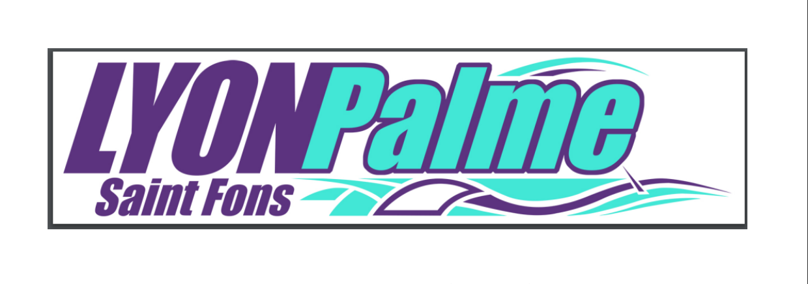

# Planning Entraînements - Lyon Palme

Application web de gestion des plannings d’entraînements pour le club **Lyon Palme**.

---

## Sommaire

- [Description](#description)
- [Fonctionnalités principales](#fonctionnalités-principales)
- [Technologies utilisées](#technologies-utilisées)
- [Diagrammes & Schémas](#diagrammes--schémas)
- [Prérequis](#prérequis)
- [Installation](#installation)
- [Créer le premier utilisateur](#créer-le-premier-utilisateur)
- [Utilisation](#utilisation)
- [Auteur](#auteur)

---

## Description

L’objectif de ce projet est de développer une application web de gestion de planning d’entraînements, destinée exclusivement aux entraîneurs du club.  
Un seul entraîneur est responsable de la création et de la modification du planning, tandis que les autres peuvent uniquement le consulter, signaler leurs indisponibilités sur les créneaux assignés, et proposer des échanges de séances.  
Seul le responsable du planning peut valider et effectuer les changements.  
L’application est développée avec Laravel, en utilisant une base de données MariaDB, et respecte la charte graphique du club, inspirée de l’univers marin.

---

## Fonctionnalités principales

- Gestion des séances et des entraînements
- Consultation du planning personnel (coach)
- Déclaration d’indisponibilité pour certaines séances
- Propositions et validation d’échanges de séances entre entraîneurs
- Gestion des rôles (admin, entraîneur)
- Sécurité : gestion des mots de passe, traçabilité des accès

---

## Technologies utilisées

| Nom | Description |
|-----|-------------|
|  | Framework PHP |
|  | Système Linux |
|  | NPM & outils front-end |
|  | Contrôle de version |
|  | Langage backend |
|  | Base de données |
|  | Serveur web |
| Blade, Tailwind CSS | Frontend |

---

## Diagrammes & Base de données

### Diagramme de cas d'utilisation


### Base de données


---

## Prérequis

- **PHP** >= 8.1
- **Composer**
- **Node.js** & **NPM**
- **MariaDB** 
- **Apache 2**
- **Debian** 
- **Git**

---

## Installation

1. **Cloner le dépôt**
   ```bash
   git clone https://github.com/pseudoauteur/nomduprojet.git
   cd planningentrainements
   ```
2. **Droits fichiers**
   Puis vous devez vous placer dans le projet et accorder les droits à deux fichiers en utilisant les commandes ci-dessous. Assurez-vous de remplacer "votreusername" par votre nom d'utilisateur sur votre machine :

   ```xml
   sudo chown -R votreusername:www-data bootstrap/cache/
   sudo chown -R votreusername:www-data storage
   sudo chmod -R 755 bootstrap/cache/
   sudo chmod -R 755 storage/
   ```

3. **Installer les dépendances PHP**
   ```bash
   composer install
   ```

4. **Installer les dépendances front-end**
   ```bash
   npm install
   npm run build
   ```

5. **Configurer l’environnement**
   - Rennomer le fichier `.env.example` en `.env`
   - Modifier les variables de connexion à la base de données :
     ```
     DB_CONNECTION=mariadb
     DB_HOST=127.0.0.1
     DB_PORT=3306
     DB_DATABASE=nomdevotredatabase
     DB_USERNAME=ton_user
     DB_PASSWORD=ton_mot_de_passe
     ```

6. **Générer la clé d’application**
   ```bash
   php artisan key:generate
   ```

7. **Lancer les migrations et les seeders**
   ```bash
   php artisan migrate --seed
   ```

8. **Démarrer le serveur**
   ```bash
   php artisan serve
   ```
   Ou configurer Apache pour pointer vers le dossier `public/`.

---

## Créer le premier utilisateur

- Si aucun utilisateur n’existe, créez-en un via l’interface d’inscription ou via un seeder.
- Si vous voulez créer un utilisateur admin depuis l'interface d'inscription , remplissez le formulaire puis rendez vous dans la base de données dans la table entraîneur pour modifié le rôle de l'utilisateur créé.

- Exemple de comptes par défaut :
  - **Admin / Responsable planning**
    - Email : admin@lyonpalme.fr
    - Mot de passe : admin123
  - **Entraîneur**
    - Email : coach@lyonpalme.fr
    - Mot de passe : coach123

---

## Utilisation

- Rendez-vous sur [http://localhost:8000](http://localhost:8000) ou l’URL de votre serveur.
- Connectez-vous avec un compte existant ou créez-en un.

---

## Auteur

Bastian VIVIER-MERLE, Fatih FAKILI, Aragorn DE-GAUDEMAR-ANCEY

---
